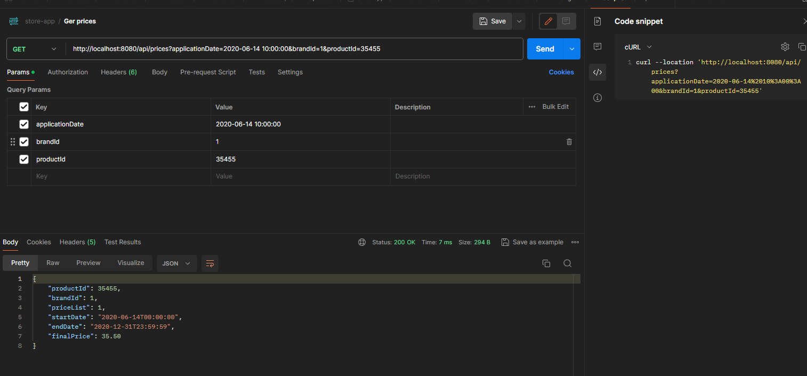

## Estructura de proyecto

El proyecto sigue una arquitectura hexagonal. Este modelo arquitectónico hace hincapié en la separación de intereses y la modularidad, dividiendo la aplicación en varias capas.
```
      ├── app                          => Business logic layer
      │   └──Dispenser service
      ├── domain                       => Domain packages
      │   ├── actions                  => Domain Interfaces/services ports to decouple operations
      │   ├── mapper                   => DTOs mappers 
      │   ├── entity                   => Domain entities
      │   └── exception                => Domain exceptions
      └── infra                        => I/O and persistence logic
          └── api                      => App Controllers
              ├── req                  => Request custom dtos
              ├── res                  => Response custom dtos
              └── Controller
          
         
```

# Testing
He realizado test de integracion para los casos dados y añadido uno por cada tipología de error.

# Postman
En mi día a día uso postman como método de documentación de eps, ya que mobile realiza los mocks desde los ejemplos que subo
